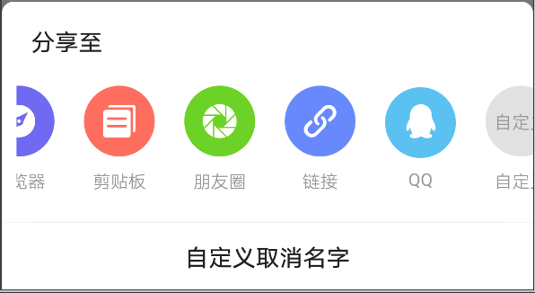
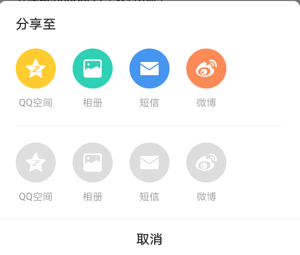
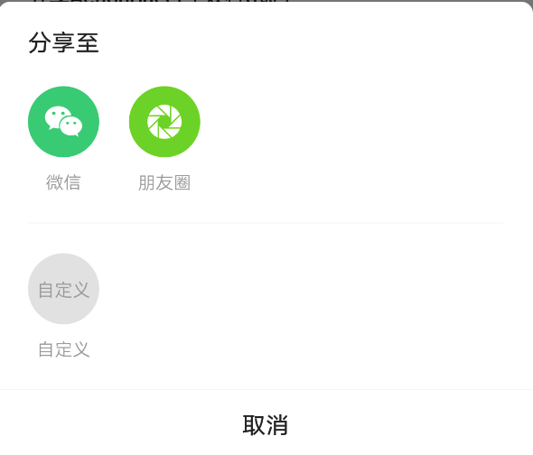
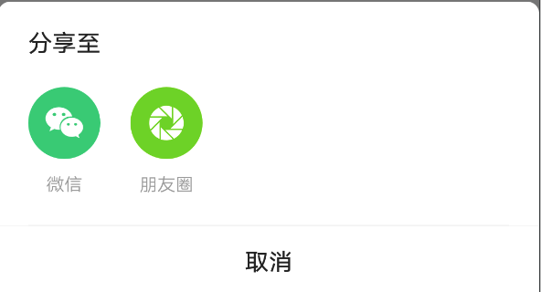

# WaveShareActionSheet

分享专用ActionSheet

## 一、效果总览


<br/>

<br/>

<br/>



## 二、描述

### 适用场景

1. 吸底列表弹框

2. 可指定任意数量的需要展示的分享渠道图标（目前内设有：微信，朋友圈，qq，qq空间，微博，链接，短信）

3. 如需展示内设渠道之外的分享渠道，支持自定义展示渠道图标

4. 可自定义取消按钮名称


## 三、构造函数及参数说明

### 构造函数

```dart
WaveShareActionSheet({
    this.firstShareChannels,
    this.secondShareChannels,
    this.mainTitle,
    this.clickCallBack,
    this.clickInterceptor,
    this.cancelTitle,
    this.shareTextColor = const Color(0xff999999),
    this.textColor = const Color(0xff222222),
  });
```


### 参数说明

#### WaveShareItem 

| 参数名 | 参数类型 | 描述 |
| --- | --- | --- |
| shareType | int | 分享类型（参考WaveShareItemConstants中的枚举，如果此项不为自定义，则自定义名称和图标不生效） |
| customTitle | String? | 自定义标题 |
| customImage | Widget? | 自定义图标 |
| canClick | bool | 是否可点击（如果为预设类型，设置为不可点击后会变为相应的置灰图标）默认为true |

#### WaveShareActionSheet

| **参数名** | **参数类型** | **描述** | **是否必填** | **默认值** |
| --- | --- | --- | --- | --- |
| firstShareChannels | `List<WaveShareItem>?` | 第一行渠道列表 | 否 | 空 |
| secondShareChannels | `List<WaveShareItem>?` | 第二行渠道列表 | 否 |  |
| mainTitle | String? | 列表标题 | 否 |  |
| clickCallBack | WaveShareActionSheetItemClickCallBack? | 点击分享渠道图标后回调方法 | 否 | 空 |
| cancelTitle | String? | 取消按钮的文案 | 否 | ''取消'' |
| context | BuildContext | BuidContext | 是 | 空 |
| shareTextColor | Color | 分享渠道文案颜色 | 否 | Color(0xff999999)灰色 |
| textColor | Color | 选项标题颜色 | 否 | Color(0xff222222)黑色 |
| clickInterceptor | WaveShareActionSheetOnItemClickInterceptor? | 是否可点击（如果为预设类型，设置为不可点击后会变为相应的置灰图标）默认为true | 否 |  |

### 其他数据

| 常量名                               | 渠道名                                                       |
| ------------------------------------ | ------------------------------------------------------------ |
| WaveShareItemConstants.shareWeiXin    | 微信                                                         |
| WaveShareItemConstants.shareFriend    | 朋友圈                                                       |
| WaveShareItemConstants.shareQQ        | qq                                                           |
| WaveShareItemConstants.shareQZone     | qq空间                                                       |
| WaveShareItemConstants.shareWeiBo     | 微博                                                         |
| WaveShareItemConstants.shareLink      | 链接                                                         |
| WaveShareItemConstants.shareSms       | 短信                                                         |
| WaveShareItemConstants.shareCopyLink  | 剪贴板                                                       |
| WaveShareItemConstants.shareBrowser   | 浏览器                                                       |
| WaveShareItemConstants.shareSaveImage | 相册                                                         |
| WaveShareItemConstants.shareCustom    | 自定义自定义图标需在`getCustomChannelTitle`方法中设置文案，在`getCustomChannelWidget`方法中设定图标。如其中一个为空，则不显示自定义图标。 |


## 效果及代码展示

### 效果1： 六个分享渠道+两个自定义


```dart
List<WaveShareItem> firstRowList = [];
firstRowList.add(WaveShareItem(
  WaveShareItemConstants.shareWeiXin,
  canClick: true,
));
firstRowList.add(WaveShareItem(
  WaveShareItemConstants.shareBrowser,
  canClick: true,
));
firstRowList.add(WaveShareItem(
  WaveShareItemConstants.shareCopyLink,
  canClick: true,
));
firstRowList.add(WaveShareItem(
  WaveShareItemConstants.shareFriend,
  canClick: true,
));
firstRowList.add(WaveShareItem(
  WaveShareItemConstants.shareLink,
  canClick: true,
));
firstRowList.add(WaveShareItem(
  WaveShareItemConstants.shareQQ,
  canClick: true,
));
firstRowList.add(WaveShareItem(
  WaveShareItemConstants.shareCustom,
  customImage: WaveUITools.getAssetImage("images/icon_custom_share.png"),
  customTitle: "自定义",
  canClick: true,
));
WaveShareActionSheet actionSheet = new WaveShareActionSheet(
  firstShareChannels: firstRowList,
  clickCallBack: (int section, int index, WaveShareItem shareItem) {
    int channel = shareItem.shareType;
    WaveToast.show("channel: $channel, section: $section, index: $index", context);
  },
  cancelTitle: "自定义取消名字", // 取消按钮title可自定义
);
actionSheet.show(context);
```
### 效果2：四个分享渠道+四个自定义


```dart
List<WaveShareItem> firstRowList = List();
List<WaveShareItem> secondRowList = List();
firstRowList.add(WaveShareItem(
  WaveShareItemConstants.shareQZone,
  canClick: true,
));
firstRowList.add(WaveShareItem(
  WaveShareItemConstants.shareSaveImage,
  canClick: true,
));
firstRowList.add(WaveShareItem(
  WaveShareItemConstants.shareSms,
  canClick: true,
));
firstRowList.add(WaveShareItem(
  WaveShareItemConstants.shareWeiBo,
  canClick: true,
));
secondRowList.add(WaveShareItem(
  WaveShareItemConstants.shareQZone,
  canClick: false,
));
secondRowList.add(WaveShareItem(
  WaveShareItemConstants.shareSaveImage,
  canClick: false,
));
secondRowList.add(WaveShareItem(
  WaveShareItemConstants.shareSms,
  canClick: false,
));
secondRowList.add(WaveShareItem(
  WaveShareItemConstants.shareWeiBo,
  canClick: false,
));
WaveShareActionSheet actionSheet = new WaveShareActionSheet(
  firstShareChannels: firstRowList,
  secondShareChannels: secondRowList,
  clickCallBack: (int section, int index, WaveShareItem shareItem) {
    int channel = shareItem.shareType;
    WaveToast.show("channel: $channel, section: $section, index: $index", context);
  },
  clickInterceptor: (int section, int index, WaveShareItem shareItem) {
    if (shareItem.canClick) {
      return false;
    } else {
      WaveToast.show("不可点击，拦截了", context);
      return true;
    }
  },
);
actionSheet.show(context);
```

### 效果3：上两个渠道+下一个自定义


```dart
List<WaveShareItem> firstRowList = [];
List<WaveShareItem> secondRowList = [];
firstRowList.add(WaveShareItem(
  WaveShareItemConstants.shareWeiXin,
  canClick: true,
));
firstRowList.add(WaveShareItem(
  WaveShareItemConstants.shareFriend,
  canClick: true,
));
secondRowList.add(WaveShareItem(
  WaveShareItemConstants.shareCustom,
  customImage: WaveUITools.getAssetImage("images/icon_custom_share.png"),
  customTitle: "自定义",
  canClick: true,
));
WaveShareActionSheet actionSheet = new WaveShareActionSheet(
  firstShareChannels: firstRowList,
  secondShareChannels: secondRowList,
  clickCallBack: (int section, int index, WaveShareItem shareItem) {
    int channel = shareItem.shareType;
    WaveToast.show("channel: $channel, section: $section, index: $index", context);
  },
);
actionSheet.show(context);
```


### 效果4：两个渠道


```dart
List<WaveShareItem> firstRowList = [];
firstRowList.add(WaveShareItem(
  WaveShareItemConstants.shareWeiXin,
  canClick: true,
));
firstRowList.add(WaveShareItem(
  WaveShareItemConstants.shareFriend,
  canClick: true,
));
WaveShareActionSheet actionSheet = new WaveShareActionSheet(
  firstShareChannels: firstRowList,
  clickCallBack: (int section, int index, WaveShareItem shareItem) {
    int channel = shareItem.shareType;
    WaveToast.show("channel: $channel, section: $section, index: $index", context);
  },
);
actionSheet.show(context);
```

