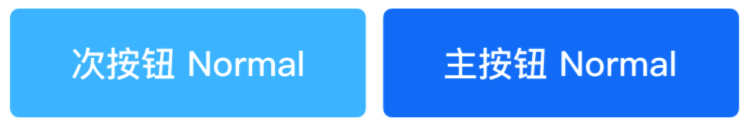
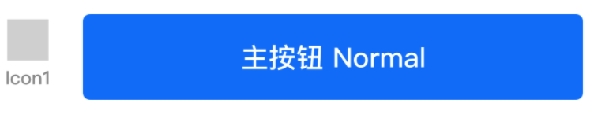
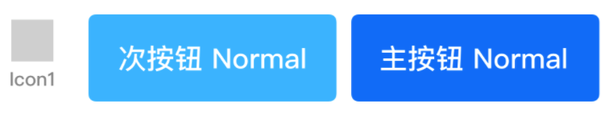
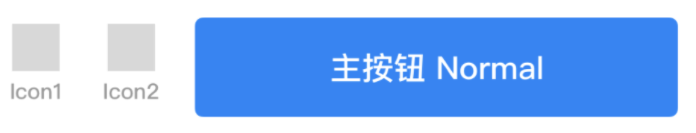
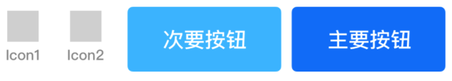
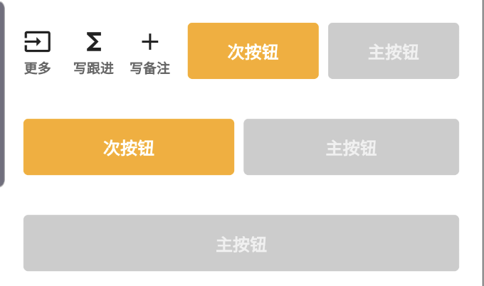
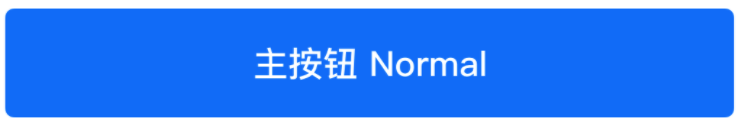
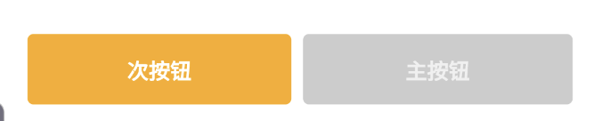

# WaveBottomButtonPanel

## 一、效果总览

样式1
<br/>

<br/>
样式2
<br/>

<br/>
样式3
<br/>

<br/>
样式4
<br/>

<br/>
样式5
<br/>

<br/>
样式6
<br/>


## 二、描述

### 适用场景

1. 常用于页面底部的组合按钮：主题色按钮、辅助色按钮、icon按钮

## 三、构造函数及参数说明

### 构造函数

```dart
const WaveBottomButtonPanel(
      {Key? key,
      required this.mainButtonName,
      required this.mainButtonOnTap,
      this.secondaryButtonName,
      this.secondaryButtonOnTap,
      this.enableMainButton = true,
      this.enableSecondaryButton = true,
      this.iconButtonList})
      : super(key: key);
```
### 参数说明

| 参数名 | 参数类型 | 描述 | 是否必填 | 默认值 |
| --- | --- | --- | --- | --- |
| mainButtonName | String | 主按钮的显示文案 | 是 | 无 |
| mainButtonOnTap | VoidCallback | 主按钮的点击回调 | 是 | 无 |
| secondaryButtonName | String? | 次按钮显示文案 | 否 | 无 |
| secondaryButtonOnTap | VoidCallback? | 次按钮的点击回调 | 否 | 无 |
| iconButtonList | List<WaveVerticalIconButton>? | icon按钮的集合 | 否 | 无 |
| enableMainButton | bool | 主按钮是否可用 | 否 | true |
| enableSecondaryButton | bool | 次按钮是否可用 | 否 | true |

## 四、代码演示

###  效果1：只有主按钮

 



```dart
WaveBottomButtonPanel(  
   mainButtonName:'主按钮 Normal',  
   mainButtonOnTap:() {  
     WaveToast.show('主按钮被点击', context);  
   },  
)
```
###  效果2：只有主按钮和次按钮

 


```dart
WaveBottomButtonPanel(  
   mainButtonName:'主按钮',  
   mainButtonOnTap:() {  
     WaveToast.show('主按钮被点击', context);  
   },  
   secondaryButtnoName:'次按钮',  
   secondaryButtonOnTap: () {  
     WaveToast.show('次按钮被点击', context);  
   },  
)
```
###  效果3：只有主按钮和一个Icon按钮

 


```dart
WaveBottomButtonPanel(  
   mainButtonName:'主按钮',  
   mainButtonOnTap:() {  
     WaveToast.show('主按钮被点击', context);  
   },  
   iconButtonList:[  
     //构造Icon按钮 
     WaveVerticalIconButton (  
       name: '更多',  
       iconWidget: _iconImage,  
       onTap:() {  
         WaveToast.show('更多按钮被点击', context);  
       }  
     )  
   ]
 )
```
###  效果4：一个主按钮，一个次按钮和一个Icon按钮

 


```dart
WaveBottomButtonPanel(  
   mainButtonName: '主按钮',  
   mainButtonOnTap: () {  
     WaveToast.show('主按钮被点击', context);  
   },  
   secondaryButtnoName: '次按钮',  
   secondaryButtonOnTap: () {  
     WaveToast.show('次按钮被点击', context);  
   },  
   iconButtonList: [  
     //构造Icon按钮  
     WaveVerticalIconButton(  
         name: 'Icon1',  
         iconWidget: _iconImage,  
         onTap: () {  
           WaveToast.show('更多按钮被点击', context);  
         }  
     )  
   ]  
 )
```
###  效果5：一个主按钮，多个Icon按钮

 


```dart
WaveBottomButtonPanel(  
   mainButtonName: '主按钮',  
   mainButtonOnTap: () {  
     WaveToast.show('主按钮被点击', context);  
   },  
   iconButtonList: [  
     //构造Icon按钮 
     WaveVerticalIconButton(  
         name: 'Icon1',  
         iconWidget: _iconImage,  
         onTap: () {  
           WaveToast.show('更多按钮被点击', context);  
         }  
     ),  
     WaveVerticalIconButton(  
         name: 'Icon2',  
         iconWidget: _iconImage,  
         onTap: () {  
           WaveToast.show('更多按钮被点击', context);  
         }  
     )  
   ]  
)  
```
###  效果6：一个主按钮，一个次按钮和多个Icon按钮

 


```dart
WaveBottomButtonPanel(  
   mainButtonName: '主要按钮',  
   mainButtonOnTap: () {  
     WaveToast.show('主按钮被点击', context);  
   },  
   secondaryButtnoName:'次要按钮',  
   secondaryButtonOnTap: () {  
     WaveToast.show('次按钮被点击', context);  
   },  
   iconButtonList: [  
     WaveVerticalIconButton(  
         name: 'Icon1',  
         iconWidget: _iconImage,  
         onTap: () {  
           WaveToast.show('更多按钮被点击', context);  
         }  
     ),  
     WaveVerticalIconButton(  
         name: 'Icon2',  
         iconWidget: _iconImage,  
         onTap: () {  
           WaveToast.show('更多按钮被点击', context);  
         }  
     )  
   ]  
)  
```
###  效果7：一个不可用的主按钮，一个可用的次按钮

 


```dart
WaveBottomButtonPanel(  
   mainButtonName: '主按钮',  
   mainButtonOnTap: () {  
     WaveToast.show('主按钮被点击', context);  
   },  
   iconButtonList: [  
     //构造Icon按钮
     WaveVerticalIconButton(  
         name: 'Icon1',  
         iconWidget: _iconImage,  
         onTap: () {  
           WaveToast.show('更多按钮被点击', context);  
         }  
     ),  
     WaveVerticalIconButton(  
         name: 'Icon2',  
         iconWidget: _iconImage,  
         onTap: () {  
           WaveToast.show('更多按钮被点击', context);  
         }  
     )  
   ]  
)
```
###  效果8：一个主按钮，一个次按钮和多个Icon按钮

 




```dart
//次按钮的颜色可以通过 主题定制来修改
//WaveThemeConfigurator.instance.getConfig().commonConfig.brandAuxiliary
WaveBottomButtonPanel(  
  mainButtonName: '主按钮',  
  enableMainButton: false,  
  mainButtonOnTap: () {  
    WaveToast.show('主按钮', context);  
  },  
  secondaryButtnoName: '次按钮',  
  secondaryButtonOnTap: () {  
    WaveToast.show('次按钮', context);  
  }  
)
```
